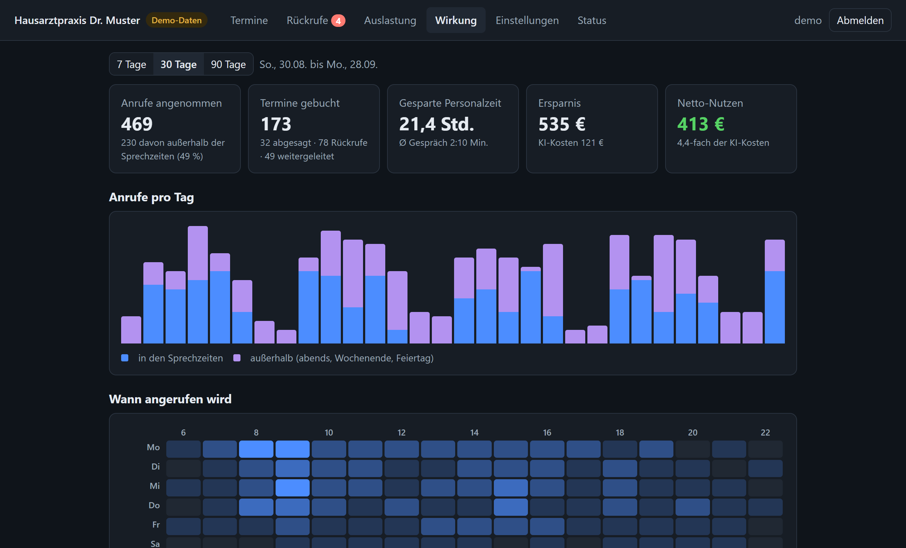
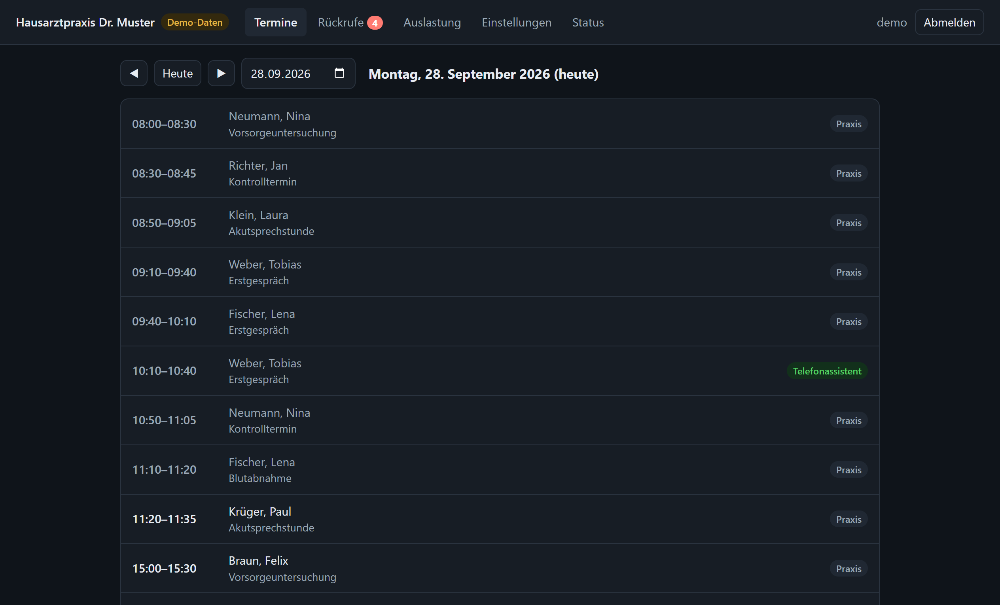
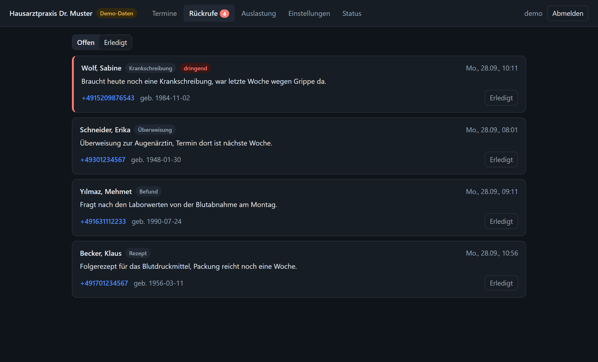
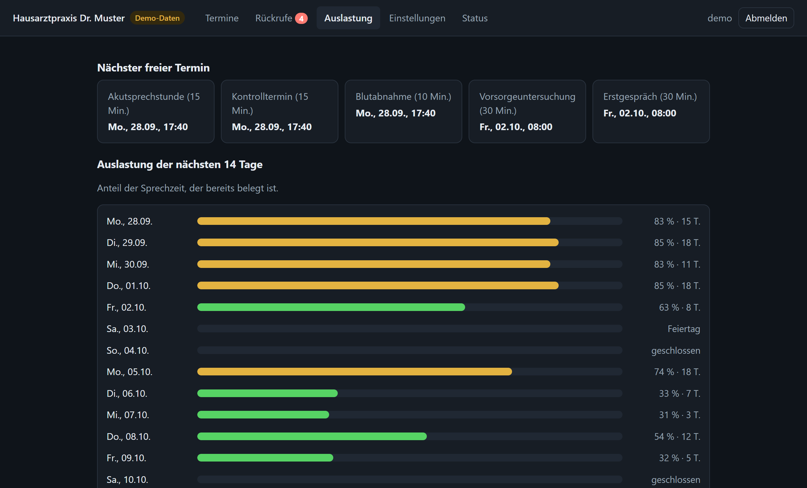
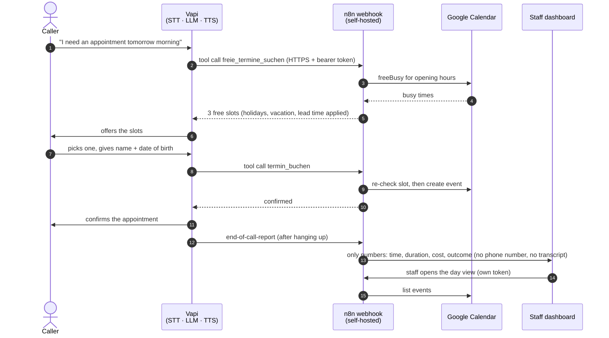

# AI phone assistant for a doctor's office

[](https://github.com/joel1220-bmg/praxis-telefonassistent/actions/workflows/tests.yml)


> **Kurz auf Deutsch:** Ein deutschsprachiger KI-Telefonassistent für Arztpraxen. Patientinnen und Patienten rufen an, der Voice Agent (Vapi) sucht freie Termine, bucht, sagt ab und nimmt Rückrufwünsche auf. Die Logik läuft als n8n-Workflows auf einem **selbst gehosteten Hetzner-Server** (Docker, Caddy, Postgres), Google Calendar ist die Quelle der Wahrheit. Dazu gibt es ein Web-Dashboard fürs Praxisteam. Die Kernlogik ist mit Unit-Tests und einem End-to-End-Test gegen ein echtes n8n abgesichert.

**Status (09/2026):** running as a **live demo** on my own Hetzner server: a Vapi phone number, self-hosted n8n and a real Google Calendar. It holds no real patient data and is not yet used by a practice. See [what runs live](#what-runs-live) and [limitations](#limitations).

**Contents:** [What happens during a call](#what-happens-during-a-call) · [Engineering highlights](#engineering-highlights) · [What runs live](#what-runs-live) · [Features](#features) · [Folder structure](#folder-structure) · [Try it yourself](#try-the-dashboard-right-away-demo-data) · [Setup](#setup) · [Tests](#tests) · [Security & data protection](#security--data-protection-please-read) · [Limitations](#limitations)



| Appointments | Callback requests | Utilisation |
|---|---|---|
|  |  |  |

*Staff dashboard in demo mode (sample data only). The tab "Wirkung" (impact) shows the ROI for the practice owner: calls handled (also outside opening hours), bookings, staff time and euros saved versus AI cost. "Telefonassistent" marks appointments the voice agent booked.*

## What happens during a call

Interactive walkthrough (German): open [`docs/architektur.html`](docs/architektur.html) in a browser (no build, no external requests). It plays five flows step by step (booking, cancelling, callback, after the call, practice team) on a diagram of the real components.



## Engineering highlights

- **Logic outside the n8n canvas, tested like normal code.** Slot calculation, validation and name matching live in `src/lib.js` (plain JavaScript). `build.js` injects them into the n8n Code nodes and generates both workflows and the Vapi assistant. That keeps them reproducible and reviewable in git diffs, and nobody hand-edits JSON.
- **Voice-specific details:** speech recognition often misspells names, so patients are found by **phonetic matching (Kölner Phonetik)** plus date of birth. Tool answers are phrased to be read aloud and tell the agent which internal values (like `start`) it must not read out.
- **No double bookings:** the slot is re-checked on the server right before booking (grid position + freeBusy). A taken slot returns alternatives.
- **Self-hosted and locked down:** Docker Compose with n8n, task runners, Postgres, the dashboard and Caddy (automatic HTTPS). On the n8n domain, only `/webhook/vapi-praxis` is reachable from the internet. The n8n editor is only available through an SSH tunnel, and the dashboard's internal routes return 403.
- **Secrets stay on the server:** tokens are generated in `docker/.env` (mode 600). On my server, I imported them into n8n with the n8n CLI, so they never went through the browser or a chat. The Vapi key is prompted invisibly and checked against Vapi before it's saved (`docker/vapi-einrichten.sh`). The Google service account has no project roles, access to a single calendar, minimal scopes and a domain allowlist.
- **ROI you can defend:** after each call Vapi sends a report; n8n reduces it to numbers (time, duration, cost, outcome from our own tool results) and the dashboard turns them into staff time and euros saved versus AI cost. The assumptions (hourly cost, follow-up time, exchange rate) are in `src/config.js` and shown next to the numbers.
- **Data minimisation:** n8n does not keep successful executions, the call report keeps no phone number or transcript, and the E2E test checks that no request data remains in n8n or the dashboard.
- **Tests:** 30 unit and server tests (logic, ROI calculation, dashboard security: login lockout, CSRF, session handling) and an E2E test that starts a real n8n 2.40.7 against a fake Google Calendar and SMTP server.

## What runs live

| Part | Where |
|---|---|
| Voice agent | Vapi, model `claude-sonnet-5`, German prompt ([`vapi/system-prompt.de.md`](vapi/system-prompt.de.md)), US test number |
| Workflows | n8n 2.40.7 on a Hetzner CX23 (Falkenstein, ~7 €/month), Docker Compose |
| Calendar | Google Calendar through a service account |
| Dashboard | Node server behind Caddy/HTTPS, personal logins |

**For reviewers:** access to the live dashboard and a test call are available on request (the login isn't published here).

Built from the terminal with **Claude Code** as a pair programmer. The order was: a spec with testable acceptance criteria ([`SPEC.md`](SPEC.md)), then code with tests, then hosting and live debugging on the server.

## Features

Patients call the practice number. A German-speaking AI assistant picks up and can:

- **find free appointments** based on opening hours, the Google Calendar, holidays and vacation
- **book appointments**, with a server-side re-check so nothing gets double-booked
- **recognise returning patients**: it first asks "Waren Sie schon einmal bei uns?"; for returning patients only name and date of birth are needed, and phone and insurance are taken from their last appointment
- **recover from failed tool calls**: if the language model sends an empty booking, the backend asks for all fields again; after two failed attempts it stops retrying and takes a callback request instead, so a caller never ends up in a loop
- **find, reschedule and cancel appointments**, after checking last name and date of birth
- **take callback requests** (prescriptions, referrals, results, sick notes) and e-mail them to the front desk
- **transfer the caller to the practice team** during opening hours
- **handle emergencies**: it tells the caller to hang up and dial 112, or 116 117 outside opening hours, and never gives medical advice

The practice team gets a **web dashboard** with appointments, callback requests, utilisation for the next 14 days, the impact of the assistant ("Wirkung": calls, outcomes, staff time and euros saved versus AI cost), settings and system status.

How the parts connect is shown in the [call diagram](#what-happens-during-a-call) above and, step by step, in [`docs/architektur.html`](docs/architektur.html).

## Folder structure

| Path | Contents |
|---|---|
| `src/config.js` | **Your practice data**: opening hours, appointment types, holidays, vacation, calendar, e-mail |
| `src/lib.js` | All the logic (slots, validation, name matching, call report), covered by tests |
| `vapi/system-prompt.de.md` | Conversation rules for the assistant (German) |
| `build.js` | Generates the files below from the files above |
| `n8n/praxis-telefonassistent.workflow.json` | Workflow for the phone tools (generated, don't edit by hand) |
| `n8n/praxis-dashboard-api.workflow.json` | Workflow the dashboard uses to read the calendar and cancel appointments (generated) |
| `dashboard/` | Web dashboard for the practice team (Node, no extra dependencies); `roi.js` computes the "Wirkung" numbers |
| `vapi/assistant.json` | Vapi assistant with placeholders (generated) |
| `vapi/einrichten.js` | Creates or updates the assistant in Vapi |
| `docker/` | Hosting: n8n + task runner + Postgres + dashboard + Caddy (HTTPS) |
| `test/`, `test-e2e/` | Unit tests and the end-to-end test against a real n8n |
| `docs/` | Interactive architecture page and the screenshots used here |
| `SPEC.md` | Goals and testable acceptance criteria for each part |

After every change to `src/` or the prompt: `npm run build`, then re-import the workflows, run `vapi/einrichten.js` again and restart the dashboard.

## Try the dashboard right away (demo data)

Needs only Node 22.13 or newer, no accounts.

```bash
npm install
```
```bash
npm run dashboard
```
Open http://127.0.0.1:8080 and log in with user **demo**, password **demo**. Everything you see is sample data; nothing is connected. In demo mode the server only listens on your own PC.

## Test call from your smartphone (local, free)

Everything runs on your PC. A test calendar stands in for Google, so no Google setup is needed. Vapi gives new accounts free starting credit.

1. Once: `npm install`. n8n is already in `lokal/n8n` (otherwise `cd lokal/n8n && npm install n8n@2.40.7`), and `cloudflared.exe` in `lokal/werkzeuge/`.
2. Start:
```bash
node lokal/start.js
```
3. Create a free account at dashboard.vapi.ai and copy the **private** key under API Keys. Then, in a second PowerShell window in the project folder:
```bash
$env:VAPI_API_KEY="<private key>"
```
```bash
node vapi/einrichten.js --lokal
```
The script gets the tunnel address and token from `lokal/daten/` itself, creates the credential and the assistant at Vapi, and remembers their IDs in `lokal/daten/vapi.json`. After every restart of `lokal/start.js` (new tunnel address), just run the same command again. If Vapi rejects creating the credential automatically, the script shows the manual way.
4. To call: on your smartphone, open dashboard.vapi.ai → your assistant → **Talk to Assistant**. That's a free web call in the browser. A real phone number would be an extra cost, because Vapi's free numbers are US numbers.

From the internet, only the Vapi webhook can be reached (a gatekeeper proxy sits in front of n8n); the n8n editor and the dashboard stay local. The tunnel address changes on every start; `node vapi/einrichten.js --lokal` updates the assistant. Test data is in `lokal/daten/` (git-ignored); delete it to start from scratch.

## Setup

### 1. Adjust the practice data
Edit `src/config.js`: name, address, opening hours, appointment types and lengths, holidays **including your state's regional holidays**, vacation, e-mail addresses. Then:

```bash
npm install
```
```bash
npm test
```
```bash
npm run build
```

### 2. Host n8n (EU server, e.g. Hetzner or IONOS)
You need a server with Docker and two domains whose DNS points to the server, e.g. `n8n.praxis-muster.de` and `dashboard.praxis-muster.de`.

```bash
cd docker && cp .env.example .env
```
Fill in `.env` (both domains and six random values, e.g. `openssl rand -hex 32` each), then:
```bash
docker compose up -d
```

#### n8n editor (only through an SSH tunnel)
On the n8n domain, Caddy lets only `/webhook/vapi-praxis` through; everything else returns 403, and n8n listens only on `127.0.0.1:5678` of the server. To open the editor, start a tunnel from your PC and leave it running:
```bash
ssh -N -L 5678:127.0.0.1:5678 root@<server>
```
Then open http://localhost:5678, create the owner account and **turn on two-factor authentication**. All the following n8n steps happen there.

### 3. Create the credentials in n8n
1. **Header Auth** named `Vapi Bearer-Token`: name `Authorization`, value `Bearer <VAPI_WEBHOOK_TOKEN from .env>`.
2. **Google Service Account API** named `Google Service Account Praxis`: in Google Cloud, enable the Calendar API and create a service account (no roles) with a JSON key. Share the practice calendar with the service account's e-mail ("Make changes and see all event details") and put that calendar's ID into `kalenderId` in `src/config.js` (not `primary`). In n8n, enter the service account e-mail and the private key from the JSON file; never commit the key. Paste the key with real line breaks, e.g. copy it with PowerShell: `(Get-Content <file>.json -Raw | ConvertFrom-Json).private_key | Set-Clipboard` (otherwise n8n reports "secretOrPrivateKey must be an asymmetric key"). The calendar nodes are HTTP Request nodes, so also turn on **"Set up for use in HTTP Request node"**, set **Scope(s)** to `https://www.googleapis.com/auth/calendar.events https://www.googleapis.com/auth/calendar.freebusy`, and set **Allowed HTTP Request Domains** to *Specific Domains* `www.googleapis.com, oauth2.googleapis.com` (without `oauth2.…` no token can be fetched and the assistant only says "Kalender nicht erreichbar"). Delete the JSON file afterwards. Use a **Google Workspace** account with a data processing agreement, not a private Gmail account. (Tests and `lokal/start.js` build with `--google-auth oauth` and use the credential `Google Kalender Praxis` against the fake calendar.)
3. **SMTP** named `SMTP Praxis`: the practice's mail server, with TLS.
4. **Header Auth** named `Dashboard API-Token`: name `Authorization`, value `Bearer <DASHBOARD_API_TOKEN from .env>`.
5. **Header Auth** named `Dashboard Intern-Token`: name `Authorization`, value `Bearer <DASHBOARD_INTERN_TOKEN from .env>`.

### 4. Import and activate the workflows
```bash
docker compose exec n8n n8n import:workflow --separate --input=/import
```
Open each workflow in n8n and pick the right credential in each red node, then **publish** it:
- **Praxis-Telefonassistent**: the webhook (`Vapi Bearer-Token`), the 7 calendar nodes, the e-mail node, "Dashboard: Rückruf speichern" and "Dashboard: Anruf speichern" (both `Dashboard Intern-Token`). Webhook URL: `https://<n8n-domain>/webhook/vapi-praxis`.
- **Praxis-Dashboard-API**: the webhook (`Dashboard API-Token`) and the 3 calendar nodes.

### 4b. Create dashboard users
One login per team member (password at least 10 characters, typed invisibly):
```bash
docker compose run --rm dashboard node dashboard/benutzer.js anlegen anna
```
`liste` shows all users, and `loeschen <name>` removes one. Changes take effect immediately: a deleted user is logged out right away, and no restart is needed. The dashboard is then at `https://<dashboard-domain>`.

Only set `DASHBOARD_HINTER_PROXY=1` (already set in `docker-compose.yml`) when Caddy sits in front. Without a proxy, a client could fake its IP address and get around the login lockout.

### 5. Set up Vapi
1. In the Vapi dashboard, create a **Bearer Token credential** with the same token as in step 3.1 and copy its ID.
2. Buy or connect a German phone number (Vapi, Twilio, or forwarding from the practice's phone system).
3. Pick a German voice in ElevenLabs (via Vapi) and copy its voice ID.
4. Set the environment variables `VAPI_API_KEY`, `N8N_WEBHOOK_URL`, `VAPI_CREDENTIAL_ID`, `PRAXIS_TELEFON` and `ELEVENLABS_VOICE_ID`, then:
```bash
node vapi/einrichten.js
```
5. In the dashboard, assign the assistant to the phone number. Test it first with the **web call** in the dashboard, then with a real call.

**Shortcut on the server (Docker setup):** steps 1, 4 and 5 in one command. It asks once for the Vapi **Private** API key (invisible input, checked against Vapi before saving) and stores it in `docker/.env` (mode 600). The credential is created from `VAPI_WEBHOOK_TOKEN` in `.env`, so the token never leaves the server. Set `VAPI_ASSISTANT_ID` / `VAPI_NUMMER_ID` in `.env` to reuse an existing assistant and number; the IDs of new ones are saved automatically. Optional in `.env`: `PRAXIS_TELEFON`, `ELEVENLABS_VOICE_ID`, `VAPI_MODELL`.
```bash
ssh -t root@<server> /opt/praxis/docker/vapi-einrichten.sh
```

**Model:** `claude-sonnet-5`. Vapi does not offer `claude-opus-5` (as of 09/2026). For even shorter pauses, run `vapi/einrichten.js` with `VAPI_MODELL=claude-haiku-4-5-20251001`. If a model name is invalid, Vapi lists the allowed names in its error message.

**Speech recognition:** Deepgram `nova-3` (German) with a `keyterm` list (insurance types, appointment types) built from `src/config.js`. With `nova-2`, "privat" was sometimes transcribed as "Prima".

### 6. Demo appointments (optional)
`scripts/demo-termine.js` fills the practice calendar with realistic, clearly fictional appointments: 90 days of history (so the assistant recognises returning patients) and the next 28 days, fuller in the coming days and emptier later, always leaving free slots for test calls. Every demo event carries the private property `demo=1`.
```bash
node scripts/demo-termine.js --vorschau
```
`--einspielen` writes them (needs `GOOGLE_SA_DATEI`, a service-account JSON with write access to the calendar), `--entfernen` deletes all events with `demo=1`. Test person for calls as a returning patient: **Erika Mustermann, born 12.08.1964**.

## Tests

```bash
npm test
```
```bash
N8N_E2E_DIR=<empty folder> npm run e2e
```
`npm test` covers the logic and the dashboard server: login, lockout after 5 failed attempts, CSRF protection, all API routes, error cases, extracting the call report and the ROI calculation (fixed data, opening hours, holiday).

The E2E test starts a real n8n (2.40.7) with a fake Google Calendar and a fake mail server, plus the real dashboard in live mode. It covers search, booking, double booking, a slot taken by someone else, find (with name variants), cancellation, wrong date of birth, callback e-mail, invalid input, Google outage and missing token, and it checks that **successful executions are not stored**. On the dashboard side it checks that a phone booking shows up in the dashboard, that callbacks from the phone land there, that cancelling in the dashboard deletes the appointment in the calendar, that a call report reaches the ROI view without transcript or phone number (and a duplicate report isn't counted twice), and that callbacks still go out by e-mail when the dashboard is offline.

## Security & data protection (please read)

What is built in:
- The webhook only accepts requests with the bearer token. Every input is validated and length-limited, and e-mail header injection is blocked.
- The assistant can only find or cancel appointments it booked itself, and only with last name + date of birth.
- At most 2 open appointments per person (configurable), to prevent abuse.
- n8n does **not keep successful executions**: it only marks them for deletion at first, and the settings in `docker-compose.yml` delete them for good within about a minute. Errors are deleted after 72 hours. Recording is turned off in Vapi.
- **Call reports (ROI view):** Vapi sends only the `end-of-call-report` to n8n (`serverMessages`). The report does contain the transcript and the caller's number, but n8n passes on only the Vapi call ID (to drop duplicates), time, duration, cost, end reason and four yes/no outcomes. Successful executions aren't stored; if the workflow fails, the error execution (with the full report) stays in n8n for up to 72 hours like any other error. The dashboard keeps these numbers for 400 days (`roi.aufbewahrenTage`) and never sees names, numbers or content.
- Only minimal data is asked for: a keyword for the reason, not symptoms in detail.
- **Dashboard:** personal logins (passwords as scrypt hashes), lockout after 5 failed attempts, session cookie HttpOnly/SameSite=Strict/Secure, CSRF protection, strict content security policy. Done callback requests are deleted automatically after 30 days (`rueckrufeAufbewahrenTage`). The internal endpoints are blocked from outside by Caddy. Recommended: make the dashboard reachable only from the practice network (see `docker/Caddyfile`).

**Must be sorted out before going live**, because this is health data (GDPR Art. 9) and medical confidentiality (§ 203 StGB):
- **Data processing agreements (AVV)** with Vapi, the LLM provider (Anthropic), ElevenLabs, Deepgram, Google and the server host. Vapi is a US provider, so check the data transfer basis (EU-US Data Privacy Framework or standard contractual clauses) and data residency.
- A privacy notice on the practice website plus a short notice at the start of the call. The AI disclosure is already in the greeting (EU AI Act).
- Retention in Vapi: check transcripts and call logs in the dashboard, and set the shortest retention.
- Have a data protection officer or lawyer review everything. **This is not legal advice.**

## Limitations

- Only appointments booked by the assistant can be found or cancelled by it. Appointments made at the desk stay with the team.
- One calendar (one doctor or a shared calendar). Multiple doctors would be an extension.
- Only incoming calls. SMS or phone reminders are not included.
- Double bookings in the exact same second (two callers, same slot) are unlikely but theoretically possible.
- The dashboard only shows settings; they are changed in `src/config.js`. Users are managed with the command-line script, not in the browser.
- Live so far as a **demo** (see [What runs live](#what-runs-live)): the Docker setup, Google Calendar through the service account and the Vapi connection were checked on the real server. SMTP for callback e-mails isn't configured there yet, so callback requests only land in the dashboard. The E2E test uses the OAuth variant against a fake calendar; the service-account credential was only checked live.
